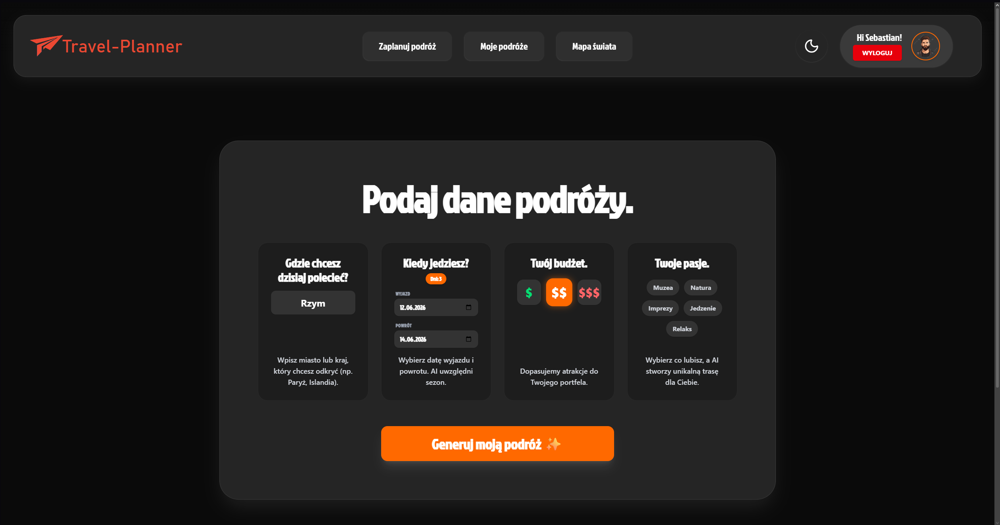
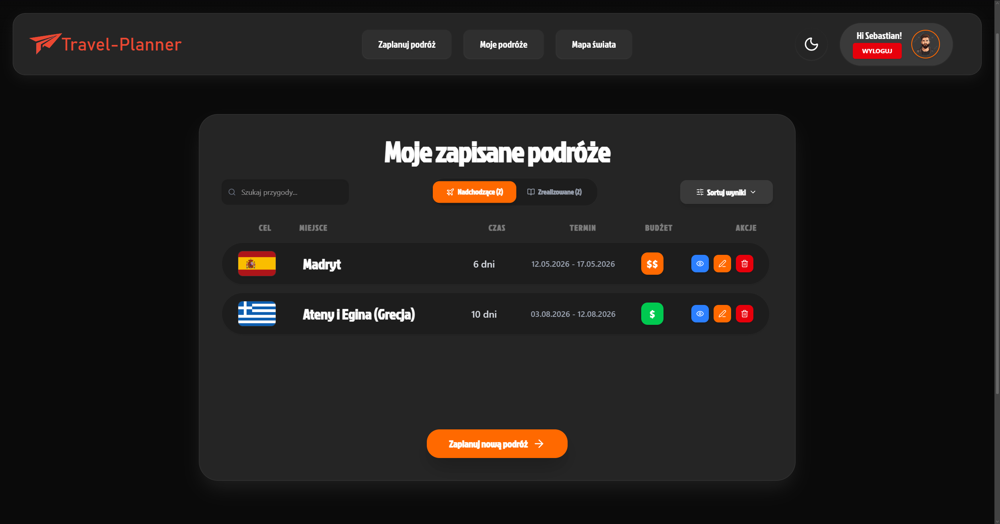
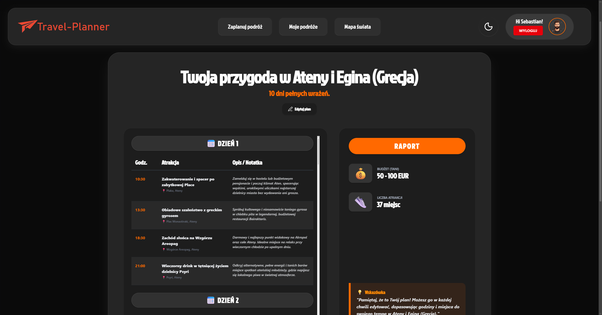
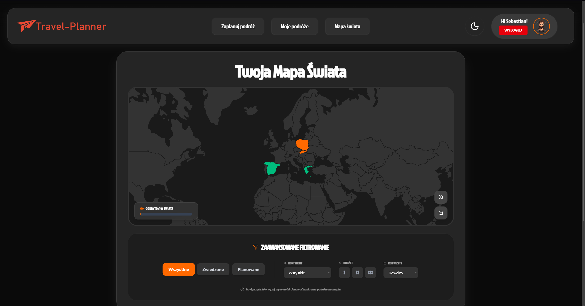
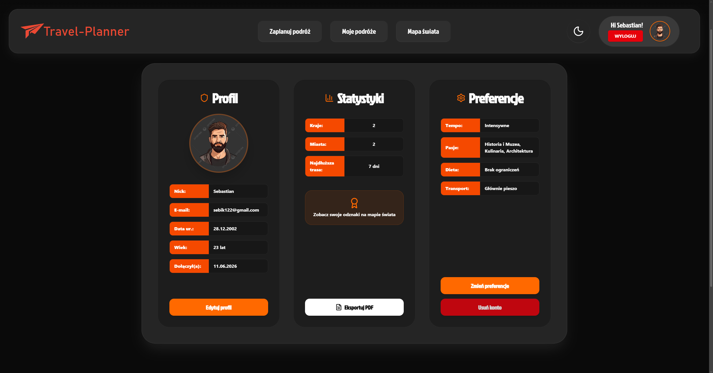
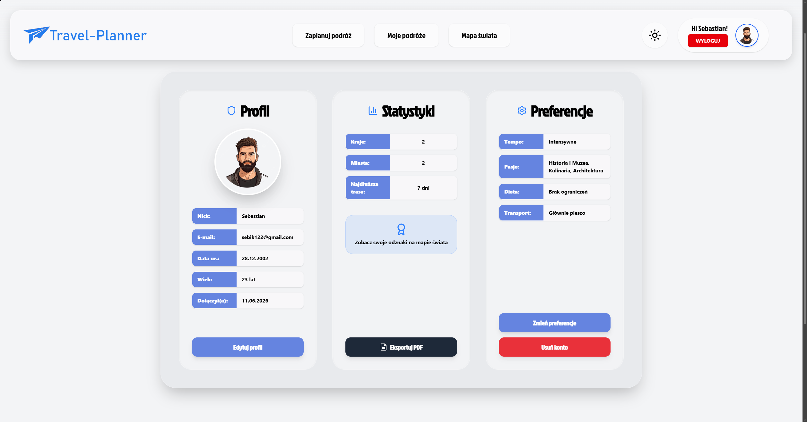

# Travel Planner - Inteligentny Planer Podróży

## Opis projektu
**Travel Planner** to aplikacja webowa wspomagana przez sztuczną inteligencję, która pomaga użytkownikom w błyskawicznym tworzeniu spersonalizowanych planów podróży. Na podstawie wprowadzonych danych (cel, czas trwania, budżet i zainteresowania), system generuje optymalną trasę zwiedzania wraz z opisem atrakcji.

**Autorzy:**
* Sebastian Iwanowski (37825)
* Norbert Jac (37689)

---

## Użyte technologie

### Funkcjonalności

* **Generator Podróży AI:** Interaktywny formularz łączący się z modelem Google Gemini AI, który generuje pełny harmonogram wyjazdu, uwzględniający indywidualne preferencje użytkownika z jego profilu.
* **Interaktywna Mapa Świata:** Wizualizacja odwiedzonych oraz planowanych państw na trójwymiarowej, interaktywnej mapie z systemem zaawansowanego filtrowania (kontynenty, budżet, lata).
* **Zarządzanie kontem i Profil:** Rejestracja/logowanie (Bcrypt + JWT), obsługa awatarów, statystyki podróżnika oraz możliwość wygenerowania i pobrania swojego raportu w formacie PDF (jsPDF + html2canvas).
* **UI/UX:** W pełni responsywny interfejs z płynnymi animacjami oraz obsługą trybu jasnego i ciemnego (Dark/Light mode).
* **Zaawansowany monitoring (Observability):** Autorski system monitorowania wydajności i logowania błędów, wykorzystujący bibliotekę `prom-client` (endpoint `/metrics`), agenta Prometheus oraz dashboard w Grafanie do analityki serwera w czasie rzeczywistym.

### Frontend
* **React + Vite** (TypeScript)
* **Tailwind CSS** (stylizacja)
* **React Router Dom** (nawigacja)
* **React Simple Maps** (wizualizacja mapy świata)
* **Lucide React** (ikony)

### Backend
* **Node.js + Express** (TypeScript)
* **PostgreSQL** (Baza danych na Supabase)
* **Prisma** (ORM)
* **JWT & Bcrypt** (Autoryzacja)
* **Google Generative AI** (Silnik rekomendacji wycieczek)
* **Prometheus & Grafana** (System monitoringu)

### AI & API
* **OpenAI / Gemini API** (Generowanie planów)

---

## Instrukcja uruchomienia lokalnego

Aby uruchomić aplikację w docelowym środowisku produkcyjnym, należy posiadać zainstalowane środowisko Node.js oraz poprawnie skonfigurowany plik `.env` (klucze bazy danych, sekret JWT, Gemini API Key).

### 1. Klonowanie repozytorium

```bash
git clone https://github.com/TAW-26/TAW-Norbert_Jac-Sebastian_Iwanowski.git
cd Travel-Planner
```

2. Uruchomienie części klienckiej (Frontend)

```bash
cd client
npm install
npm run build
npm run preview
```

Domyślny adres: http://localhost:4173

3. Uruchomienie serwera (Backend)

Otwórz drugi terminal (z głównego folderu):
```bash
cd server
npm install
npx prisma generate
npx prisma migrate deploy
npm run build
npm start
```

---

## Znane ograniczenia

Projekt w obecnej fazie posiada następujące ograniczenia architektoniczne i biznesowe:
* Infrastruktura bazy danych: Ze względu na korzystanie z darmowego klastra Supabase, baza danych może przechodzić w stan uśpienia (pause) po okresie dłuższej nieaktywności, co wydłuża czas pierwszego połączenia (cold start).
* Ręczny start monitoringu: Zastosowany stack analityczny wymaga niezależnego, ręcznego uruchomienia instancji Prometheusa i Grafany w oddzielnych oknach terminala.
* Odzyskiwanie hasła: System nie posiada obecnie funkcji resetowania zapomnianego hasła za pomocą zewnętrznego dostawcy poczty e-mail.

---

## Screenshoty z działania aplikacji








---

## Dokumentacja projektu

Szczegółowy opis założeń oraz wybór tematu znajduje się tutaj:
[Dokumentacja - Wybór Tematu](./docs/topic_selection.md)